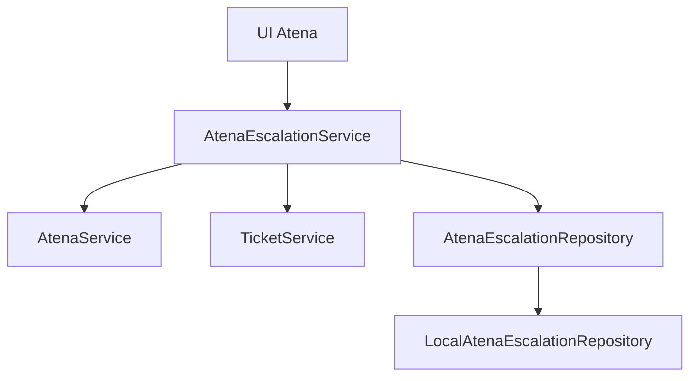

# SPEC 08 - Atena Escalation: preparação do recorte

**Estado:** PREPARED FOR REVIEW. Nenhuma implementação autorizada.
**Base oficial:** `develop`, após o merge da SPEC 07 em `f2c57f8f9bcc3dedadc802bcb1959c00028ff9f7`.
**Modo proposto:** local-first, com dados fictícios e serviços/repositórios substituíveis.
**Referências:** SPEC 03 Ticket Core, SPEC 05 Notifications, SPEC 07 Atena local, `docs/01-architecture/API_CONTRACTS.md` e `docs/HUMAN_VALIDATION_MATRIX.md`.

## Objetivo e fronteiras

Permitir que uma pessoa transforme uma conversa privada da Atena em um chamado do produto da própria conversa, depois de revisar e confirmar o conteúdo. Preservar vínculo, origem e contexto útil autorizado. A Atena não abre chamados automaticamente. Não usar respostas de provider como autoridade para escrever no domínio de tickets.

Fluxo proposto: conversa autorizada → ação “Abrir chamado” → resumo/preenchimento revisável → confirmação explícita → `TicketService` cria o chamado → vínculo persistido → navegação ao detalhe autorizado. Cancelamento não cria chamado nem vínculo.

## Contratos propostos

- `AtenaEscalationService` valida sessão, identidade, tenant e produto; prepara projeção revisável; reconfirma autorização imediatamente antes da criação; coordena idempotência e vínculo.
- `AtenaService` fornece apenas histórico e citações reautorizados da conversa atual. Seu provider/router não cria ticket nem decide permissões.
- `TicketService` mantém validação e regras de criação da SPEC 03, inclusive identidade do solicitante, número público, evento e eventual notificação existente. A UI não escreve diretamente nos repositórios.
- `AtenaEscalationRepository` armazena vínculo e chave idempotente por adaptador local. LocalStorage fica exclusivamente no adaptador. O contrato de persistência futura deve preservar IDs estáveis e unicidade transacional.
- A criação de ticket e o registro de vínculo em armazenamentos separados exigem estratégia explícita de recuperação: reservar chave, criar uma única vez e reconciliar vínculo após falha, sem abrir um segundo ticket. Antes de implementar, revisar se o contrato atual do `TicketService` suporta uma chave de origem idempotente atômica; se não, ampliar esse contrato de modo localizado.

## Escopo e proteção de dados

- Conversa pertence a um usuário, tenant e produto imutável. Apenas o dono pode preparar/confirmar a escalada; ADMIN não obtém conversas alheias.
- CLIENT só pode criar chamado em produto autorizado e no próprio contexto. SUPPORT/ADMIN não devem ganhar uma criação “em nome do cliente” implícita. Decidir na revisão se a ação fica restrita a CLIENT ou se há caso operacional autorizado para outros perfis.
- A projeção contém pergunta original, resumo útil, respostas públicas reautorizadas e referências de conhecimento que continuem publicadas/autorizadas. O usuário pode editar assunto, tipo, impacto e descrição na revisão, conforme regras do formulário de ticket.
- Nunca copiar `INTERNAL_NOTE`, anexos internos, diagnóstico, provider, prompt, payload bruto, stack, conteúdo oculto, versões históricas ou metadata administrativa para o ticket público. Conteúdo INTERNAL visto por SUPPORT não pode ser levado automaticamente para um chamado visível a CLIENT.
- Ao reabrir um preview ou confirmar, revalidar citações, produto, sessão e acesso à conversa. Revogação ou troca de identidade invalida o preview sem indicar existência de material oculto.
- O chamado guarda um snapshot mínimo, legível e auditável do contexto aprovado, além dos IDs da conversa e da escalada. A conversa preserva histórico próprio; excluir/arquivar na UI não deve destruir o vínculo.

## Modelo mínimo proposto

`AtenaEscalation`: `id`, `conversationId`, `tenantId`, `userId`, `productId`, `ticketId`, `clientRequestId`, `status`, `approvedContextSnapshot`, `createdAt`, `completedAt`. Definir estados e tratamento de reserva/recuperação após examinar a transação real do Ticket Core. Unicidade lógica: `conversationId + userId + clientRequestId`; decidir na revisão se uma conversa pode criar mais de um chamado com chaves distintas. O ticket deve portar referência estável de origem, sem aceitar `userId`/`tenantId` do formulário.

## Experiência proposta

Ação contextual na conversa; drawer de revisão no padrão Consult Services; produto fixo e visível; assunto/descrição editáveis; contexto autorizado identificável; confirmação explícita; toast, loading, erro e link para rota CLIENT do ticket. A UI não expõe IDs técnicos ou diagnóstico. Retry manual após falha consulta a mesma chave e exibe o ticket existente quando a criação já ocorreu. Estado vazio ou resposta neutra da Atena não causa abertura automática.

## Critérios de verificação a aprovar

1. CLIENT Alpha escala conversa 7Commander com revisão, recebe um único ticket e vínculo correto após refresh.
2. CLIENT Beta não vê nem usa conversa, citação ou ticket Alpha; produto da conversa não pode ser alterado.
3. Cancelamento não cria ticket; resposta neutra não dispara criação automática.
4. Conteúdo INTERNAL, nota interna, anexo, diagnóstico e conhecimento revogado não entram no contexto do ticket.
5. Outro usuário e ADMIN não acessam conversa privada; sessão alterada entre preview e confirmação falha fechada.
6. Reenvio simultâneo/refresh com mesmo `clientRequestId` não duplica ticket, notificação nem vínculo.
7. Falha entre criação de ticket e gravação do vínculo é recuperável sem ticket duplicado.
8. Criação segue validações, autorização, código público e fluxo de notificações existentes do Ticket Core.
9. Desktop, tablet e mobile: drawer, revisão, loading, erro, confirmação e navegação autorizada.

## Decisões para revisão antes de código

- Permitir escalada somente para CLIENT nesta etapa ou definir um fluxo explícito para SUPPORT/ADMIN?
- Uma conversa pode originar vários chamados, ou somente um?
- Qual é o conjunto exato de mensagens públicas e limites de tamanho do snapshot revisável?
- Como ampliar o contrato transacional do Ticket Core para idempotência cruzando os dois repositórios locais?
- Qual status de conversa deve aparecer após a escalada: continuar ativa, arquivar ou apenas mostrar o vínculo?

Estas questões não devem ser resolvidas por suposição permanente na implementação.

## Fora do escopo

OpenRouter/OpenAI reais, Supabase, RLS real, cloud, 7Service, Gmail, SLA, ferramentas da IA, criação automática de ticket, anexos de conversa e acesso a conteúdo oculto. Este documento prepara a revisão; não aprova código da SPEC 08.
